<div align="center">

# Indoor Scene Change Detection

### YOLO11s Object Detection + Alignment + Pixel Evidence + Rule-Based Add / Delete / Move Reasoning

<p>
  A complete computer-vision pipeline for detecting <b>what changed</b> between two indoor-scene images and classifying the change as <b>Add</b>, <b>Delete</b>, or <b>Move</b>.
</p>

<p>
  
  
  
  
  
</p>

</div>

---

## Overview

This project detects semantic changes between a **reference image** and a **query image** of an indoor scene. Rather than relying only on raw pixel differences, it combines object detection, camera alignment, visual-change evidence, appearance matching, and rule-based reasoning.

The detector is trained with **YOLO11s** on 56 indoor-object classes. The second stage then compares the objects in each image using camera-compensated geometry and appearance information to determine whether an object was **added, deleted, or moved**.

> **Important design choice:** the Add/Delete/Move stage is rule-based. No separate classifier is trained for change-type classification.

---

## Project Highlights

| Item | Value |
|---|---:|
| Raw images | **2,034** |
| Indoor object classes | **56** |
| Valid reference/query pairs | **915** |
| Train / Validation / Test pairs | **640 / 137 / 138** |
| Detector | **YOLO11s** |
| Training epochs | **60** |
| Training image size | **640 × 640** |
| YOLO test mAP50 | **0.849** |
| YOLO test mAP50–95 | **0.619** |
| Change-matching test accuracy | **0.739** |
| Change-matching macro F1 | **0.77** |
| Change-report coverage | **0.899** |
| Change type + object accuracy | **0.609** |

---

## System Pipeline

<p align="center">
  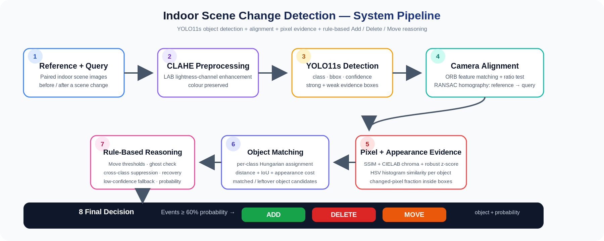
</p>

The end-to-end flow implemented in the notebook is:

1. **Reference + Query Input** — paired indoor-scene images representing the scene before and after a change.
2. **CLAHE Preprocessing** — contrast enhancement is applied only to the LAB lightness channel so colour information is preserved.
3. **YOLO11s Detection** — every detected object is represented by its class, bounding box, and confidence score.
4. **Camera Alignment** — ORB features, a ratio test, RANSAC, and a homography align the reference image to the query image.
5. **Visual Evidence** — SSIM, CIELAB chroma difference, robust z-scores, and HSV appearance histograms provide evidence that an object/location truly changed.
6. **Object Matching** — per-class Hungarian assignment matches reference and query boxes using distance, IoU, and appearance similarity.
7. **Rule-Based Reasoning** — move rules, recovery matching, ghost detections, detector-label noise suppression, and low-confidence fallback refine candidate events.
8. **Final Decision** — events with sufficient change probability are reported as **Add**, **Delete**, or **Move** together with the object and confidence/probability.

---

## Example: From Input Images to Change Detection

### 1. Raw reference/query pair

<p align="center">
  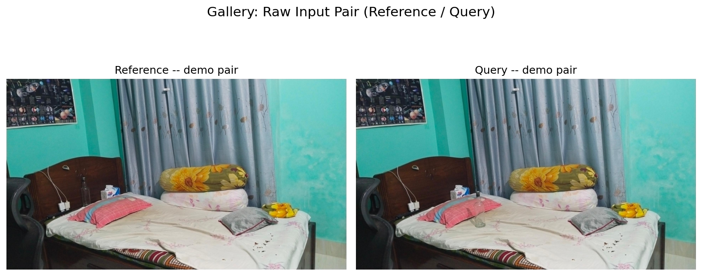
</p>

The demonstration pair contains a bottle that changes position while the surrounding scene remains mostly unchanged.

### 2. YOLO11s object detections

<p align="center">
  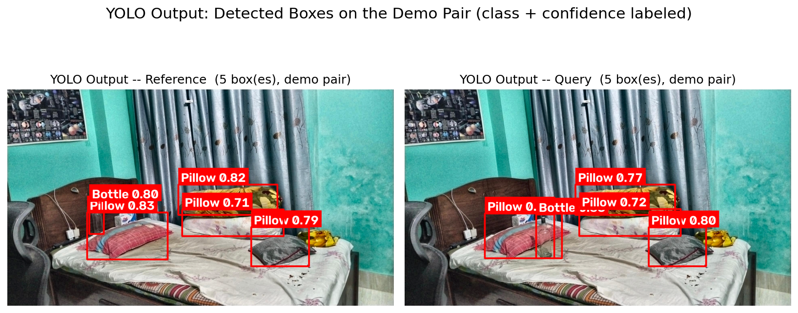
</p>

YOLO11s detects the relevant indoor objects independently in the reference and query images. Strong detections can create change events; weaker detections are retained as supporting evidence to reduce false Add/Delete decisions.

### 3. Pixel-level change evidence

<p align="center">
  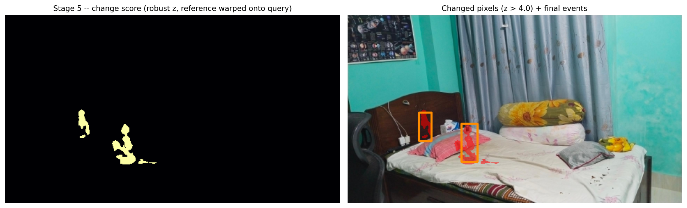
</p>

For the demo pair, the final matcher reports the bottle as a **Move** event with approximately **84% change probability**. The notebook records a displacement of about **271.5 px** and a visual-change fraction of about **45%** for this event.

---

## Dataset Preparation

The notebook expects a Label Studio-style YOLO export containing:

```text
data.zip
├── images/
├── labels/
└── classes.txt
```

Only **Add**, **Delete**, and **Move** samples are retained for the change-detection experiment. Files are parsed into before/after reference-query pairs using their filename metadata. Invalid or ambiguous pair IDs are excluded before splitting.

A pair-level split is used so both images belonging to the same scene-change pair remain in the same partition.

| Split | Add | Delete | Move | Total |
|---|---:|---:|---:|---:|
| Train | 232 | 199 | 209 | **640** |
| Validation | 50 | 43 | 44 | **137** |
| Test | 50 | 43 | 45 | **138** |
| **Total** | **332** | **285** | **298** | **915** |

<p align="center">
  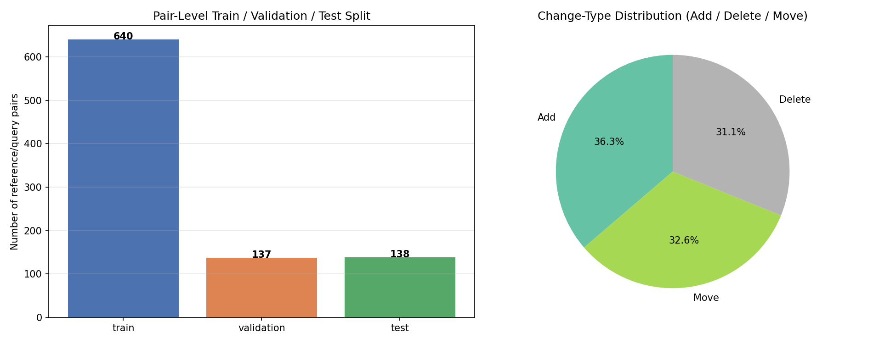
</p>

<details>
<summary><b>Change-type balance by split</b></summary>
<br>
<p align="center">
  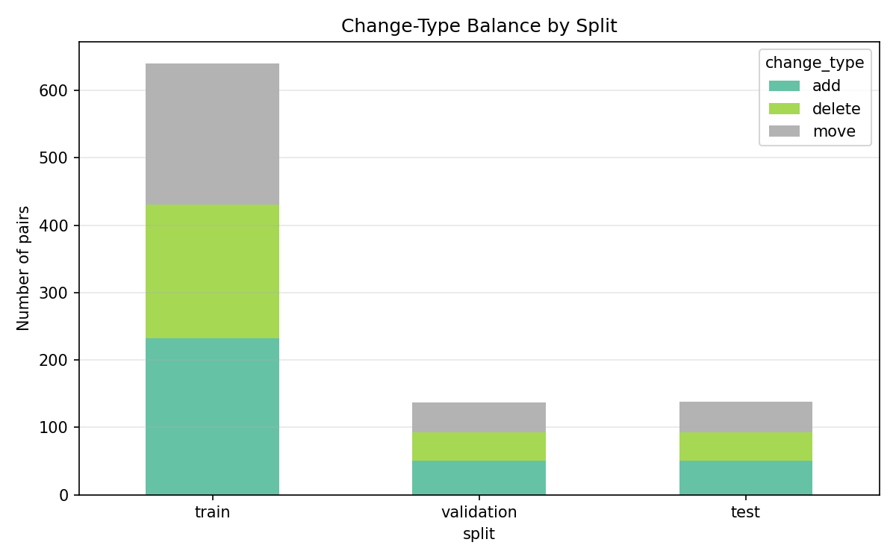
</p>
</details>

---

## Preprocessing

### CLAHE

The project uses **Contrast Limited Adaptive Histogram Equalization (CLAHE)** before object detection:

- Converts BGR → LAB.
- Applies CLAHE only to the **L** channel.
- Uses a clip limit of **2.5** and tile grid of **8 × 8**.
- Merges the enhanced lightness channel back with the original colour channels.
- Keeps backups of the original images to prevent accidentally applying CLAHE twice.

This helps normalize indoor lighting and local contrast while retaining colour cues needed later for appearance matching.

---

## YOLO11s Object Detector

The detector is trained with:

```text
Model      : YOLO11s
Epochs     : 60
Image size : 640
Task       : Object Detection
Classes    : 56
```

### Training behaviour

<p align="center">
  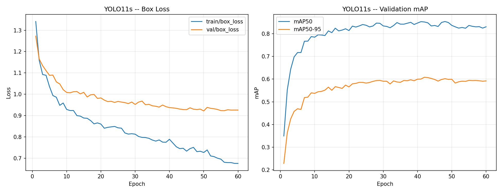
</p>

The training curves show decreasing box loss and rapid improvement in validation mAP before performance stabilizes later in training.

### Test-set detector performance

| Metric | Score |
|---|---:|
| Precision | **0.845** |
| Recall | **0.801** |
| mAP50 | **0.849** |
| mAP50–95 | **0.619** |
| F1 | **≈ 0.82** |

<p align="center">
  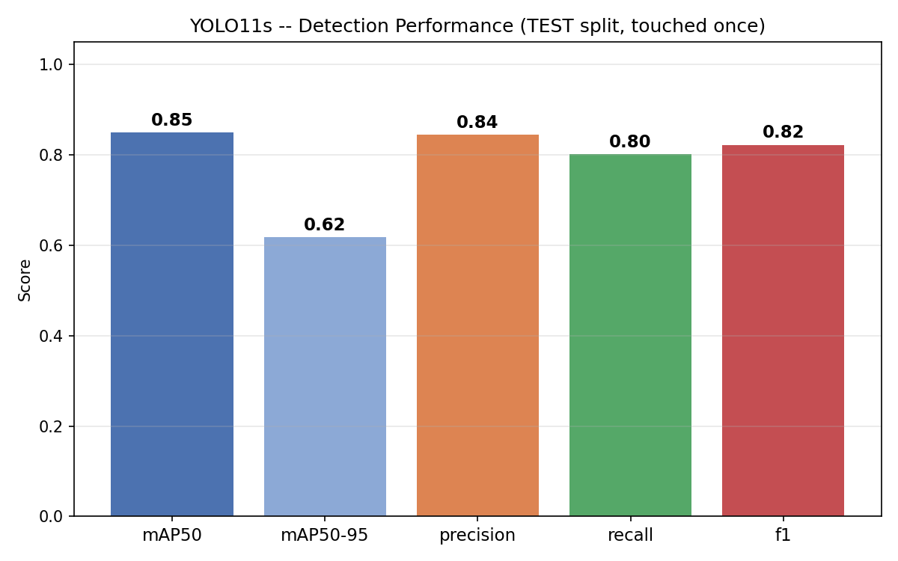
</p>

---

## Camera Alignment

A direct pixel comparison can incorrectly report changes when the camera shifts slightly. The notebook therefore estimates a reference-to-query homography before change reasoning.

The alignment stage uses:

- ORB keypoints and descriptors.
- KNN descriptor matching.
- Lowe-style ratio filtering.
- RANSAC homography estimation.
- Homography plausibility checks.
- Identity-alignment fallback when reliable alignment cannot be found.

In the recorded full run, only **2 of 915 pairs** fell back to identity alignment.

---

## Pixel-Level Change Map

After alignment, the reference image is warped into the query-image coordinate system. A visual-change map is then computed at a working width of **480 px** using complementary evidence:

- **SSIM-based structural difference** — captures structural/local appearance changes while being less sensitive to simple brightness variation.
- **CIELAB chroma difference** — captures colour changes in the `a*` and `b*` channels.
- **Robust z-score** — uses image-wide median/MAD statistics to retain unusually strong change pixels.

A candidate object is evaluated using the fraction of changed pixels within its bounding-box region.

---

## Object Matching and Change Reasoning

### Detection confidence levels

| Purpose | YOLO confidence |
|---|---:|
| Strong box — may create an event | **≥ 0.40** |
| Weak box — evidence/fallback only | **0.10–0.40** |

### Matching

Reference and query objects are matched class-by-class with the **Hungarian algorithm**. The matching cost combines:

- normalized centre distance,
- bounding-box IoU,
- HSV histogram appearance similarity.

The default matching weights are:

```text
Distance   = 0.55
IoU        = 0.20
Appearance = 0.25
```

### Change reasoning

The rules distinguish genuine scene changes from detector jitter/noise using:

- adaptive move thresholds,
- relative object-size movement checks,
- changed-pixel evidence,
- same-class recovery matching,
- weak-box “ghost” checks for possible missed detections,
- cross-class overlap suppression when the detector changes the label of the same physical object,
- Move split/merge logic,
- a low-confidence fallback pass,
- final change-probability filtering.

The final probability threshold is **0.60**.

---

## Validation-Based Threshold Tuning

The rule thresholds are tuned **only on the validation split**, keeping the test set untouched until final evaluation.

The notebook evaluates **162 threshold combinations** on **137 validation pairs**. The selected parameters are:

| Parameter | Selected value |
|---|---:|
| `pixel_k` | **4.0** |
| `visual_sat` | **0.50** |
| `min_box_change` | **0.05** |
| `move_rel_frac` | **0.10** |
| `ghost_iou` | **0.50** |

<details>
<summary><b>Threshold sensitivity plot</b></summary>
<br>
<p align="center">
  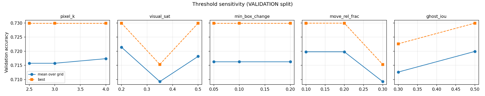
</p>
</details>

---

## Change-Detection Results

### Overall test performance

| Metric | Result |
|---|---:|
| Test pairs | **138** |
| Accuracy over all test pairs | **0.739** |
| Macro precision | **0.84** |
| Macro recall | **0.74** |
| Macro F1 | **0.77** |
| Prediction coverage | **0.899** |
| Accuracy when a change is reported | **0.823** |
| Change type + object both correct | **0.609** |

<p align="center">
  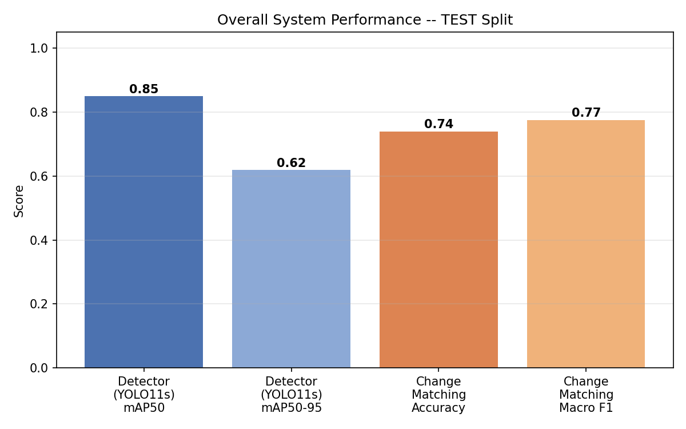
</p>

### Per-class performance

| Change | Precision | Recall | F1 | Support |
|---|---:|---:|---:|---:|
| Add | **0.82** | **0.82** | **0.82** | 50 |
| Delete | **0.74** | **0.79** | **0.76** | 43 |
| Move | **0.96** | **0.60** | **0.74** | 45 |

<p align="center">
  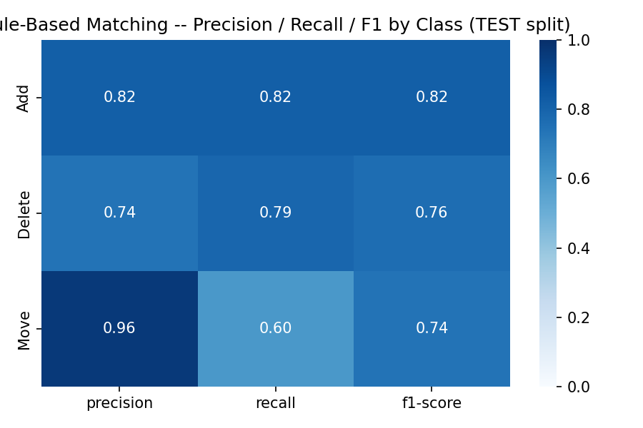
</p>

The Move class achieves high precision but lower recall, indicating that the rules are comparatively conservative when declaring motion.

### Confusion matrix

<p align="center">
  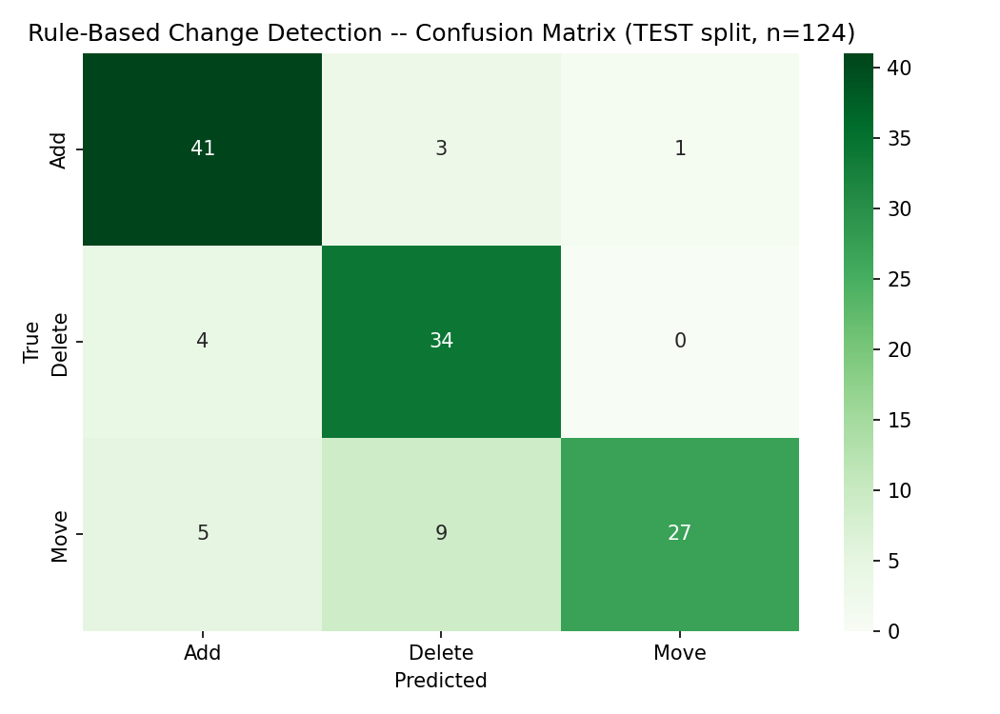
</p>

The matrix contains **124 answered test pairs**. The remaining **14 of 138** test pairs produced `None` as the primary prediction and are counted as incorrect in the reported overall accuracy.

---

## Ablation Study

The ablation experiment shows how successive rule improvements affect test performance.

<p align="center">
  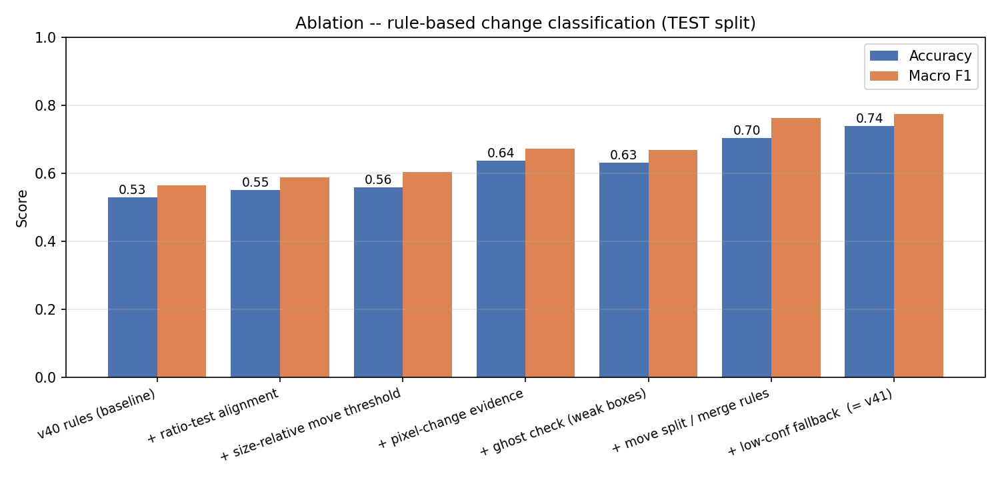
</p>

The recorded progression improves test accuracy from approximately **0.53** for the earlier rule baseline to approximately **0.74** after adding alignment improvements, size-relative movement logic, pixel-change evidence, ghost handling, Move split/merge rules, and the low-confidence fallback. Macro F1 increases from roughly **0.56** to **0.77**.

---

## Multi-Object Event Diagnostics

Across all **915 pairs**, the final pipeline generated:

- **1,495 candidate object-level events**.
- **1,105 events** passing the 60% final-decision threshold.
- Candidate events: **558 Add**, **546 Delete**, **391 Move**.
- Final reported events: **384 Add**, **380 Delete**, **341 Move**.
- **333 pairs** contained more than one candidate event.
- **178 pairs** contained more than one final reported change.
- **8 pairs** used cross-class suppression to remove likely detector-label noise.
- **25 pairs** were decided through the low-confidence fallback pass.

<details>
<summary><b>Events detected per image pair</b></summary>
<br>
<p align="center">
  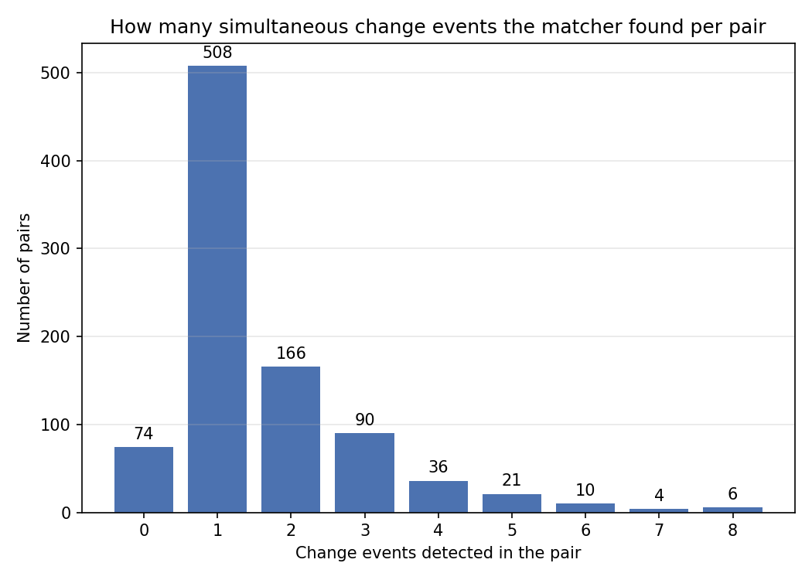
</p>
</details>

---

## Technology Stack

| Component | Technology |
|---|---|
| Programming language | Python |
| Deep-learning detector | Ultralytics YOLO11s |
| Computer vision | OpenCV |
| Numerical computing | NumPy, SciPy |
| Data handling | Pandas |
| Metrics / splitting | scikit-learn |
| Visualisation | Matplotlib, Seaborn |
| Image handling | Pillow |
| Notebook environment | Google Colab |
| Matching algorithm | SciPy `linear_sum_assignment` |
| Export / deployment | YOLO `best.pt` + JSON rule configuration |

The recorded notebook run used an NVIDIA **Tesla T4** GPU in Google Colab.

---

## Installation

The notebook installs the main dependencies automatically. For a manual environment:

```bash
pip install ultralytics pandas numpy scipy scikit-learn matplotlib seaborn opencv-python pillow pyyaml
```

A CUDA-capable GPU is recommended for YOLO training, although inference and the rule-based stage can also run on CPU at lower speed.

---

## How to Run

### Google Colab workflow

1. Open `Indoor_Scene_Change_Detection_v42.ipynb` in Google Colab.
2. Enable a GPU runtime if available.
3. Run the environment-setup cells.
4. Upload a **reference** and **query** image when prompted for the demonstration pair.
5. Upload the dataset as a file named exactly `data.zip`.
6. Ensure the ZIP contains `images/`, `labels/`, and `classes.txt` at its root.
7. Run the preprocessing and pair-generation sections.
8. Train YOLO11s for 60 epochs.
9. Run detector evaluation.
10. Build the alignment and pixel-change caches.
11. Tune rule thresholds on the validation split.
12. Run final matching and evaluate once on the test split.
13. Export CSV results, YOLO weights, configuration, and the deployment bundle.

### Core training command used by the notebook

```bash
yolo detect train \
  data=/content/data.yaml \
  model=yolo11s.pt \
  epochs=60 \
  imgsz=640 \
  project=/content/runs \
  name=yolo11s
```

---

## Exported Outputs

The notebook exports the following artifacts:

| Output | Description |
|---|---|
| `best.pt` | Trained YOLO11s detector weights |
| `config.json` | Tuned change-detection and preprocessing configuration |
| `events_full.csv` | One row per detected object-level change event |
| `results_full_with_predictions.csv` | One row per reference/query pair with ground truth and primary prediction |
| `model_metrics_validation.csv` | Detector validation metrics |
| `model_metrics_test.csv` | Detector test metrics |
| `rule_threshold_search_validation.csv` | Validation threshold-search results |
| `rule_ablation.csv` | Rule ablation results |
| `flask_model_bundle.zip` | YOLO weights + matching configuration for deployment |
| `results.zip` | Complete notebook result archive |

---

## Flask Deployment Bundle

The notebook builds a deployment directory containing:

```text
deploy/
├── best.pt
└── config.json
```

`config.json` stores the detector confidence thresholds, CLAHE settings, class names, alignment/matching rules, visual-change parameters, and the final tuned rule parameters required by a compatible Flask inference application.

---

## Repository Structure

```text
.
├── README.md
├── Indoor_Scene_Change_Detection_v42.ipynb
└── assets/
    ├── system_pipeline.png
    ├── system_pipeline.svg
    ├── raw_input_pair.png
    ├── yolo_output.png
    ├── demo_change_map.png
    ├── dataset_distribution.png
    ├── dataset_distribution_by_split.png
    ├── yolo11s_training_curves.png
    ├── yolo_test_performance.png
    ├── system_performance_summary.png
    ├── change_confusion_matrix.png
    ├── classification_report_heatmap.png
    ├── ablation_test.png
    ├── threshold_sensitivity_validation.png
    └── events_per_pair.png
```

---

## Limitations and Future Improvements

- Change reasoning depends on the quality and consistency of YOLO detections.
- Move detection is intentionally conservative; its test recall (**0.60**) is lower than its precision (**0.96**).
- Large viewpoint changes, severe occlusion, or weak feature correspondence can reduce alignment quality.
- Rule thresholds are tuned for this dataset and may require retuning for a substantially different camera setup or environment.
- A future version could compare the current rule-based reasoning stage with a learned temporal/change classifier while retaining the same detector and alignment pipeline.
- Better instance-level identity or feature embeddings could further improve matching when several objects of the same class appear close together.

---

## Collaborators

<table align="center">
<tr>
<td align="center" width="190">
  <a href="https://github.com/hasanAshraful"><br><b>Ashraful Hasan</b></a><br>
  <sub>2107036</sub>
</td>
<td align="center" width="190">
  <a href="https://github.com/TusharKumarRoy"><br><b>Tushar Kumar Roy</b></a><br>
  <sub>2107037</sub>
</td>
<td align="center" width="190">
  <a href="https://github.com/Dipta-38"><br><b>Dipta Chowdhuri</b></a><br>
  <sub>2107038</sub>
</td>
<td align="center" width="190">
  <a href="https://github.com/Mehereen-1"><br><b>Ayesha Meherin</b></a><br>
  <sub>2107039</sub>
</td>
</tr>
<tr>
<td align="center" width="190">
  <a href="https://github.com/Masum-2107040"><br><b>Masum Molla</b></a><br>
  <sub>2107040</sub>
</td>
<td align="center" width="190">
  <a href="https://github.com/Abir-49"><br><b>Abir Mahmud</b></a><br>
  <sub>2107049</sub>
</td>
<td align="center" width="190">
  <a href="https://github.com/RajorshiDas"><br><b>Rajorshi Das</b></a><br>
  <sub>2107060</sub>
</td>
<td align="center" width="190">
  <b>Team Project</b><br>
  <sub>Indoor Scene Change Detection</sub>
</td>
</tr>
</table>

> The collaborator avatars are loaded directly from each member's GitHub profile, so the displayed image follows the current GitHub profile picture. Clicking an avatar or name opens that collaborator's GitHub profile.

---

## Reproducibility Notes

- Pair splitting uses `random_state=42`.
- Threshold tuning is performed on the validation set rather than the test set.
- The test detector evaluation is explicitly run once after model selection.
- The final change-decision threshold is **60%**.
- The provided figures in `assets/` are the recorded outputs from the supplied notebook run.

---

<div align="center">

**Indoor Scene Change Detection — detecting what changed, where it changed, and how it changed.**

</div>
